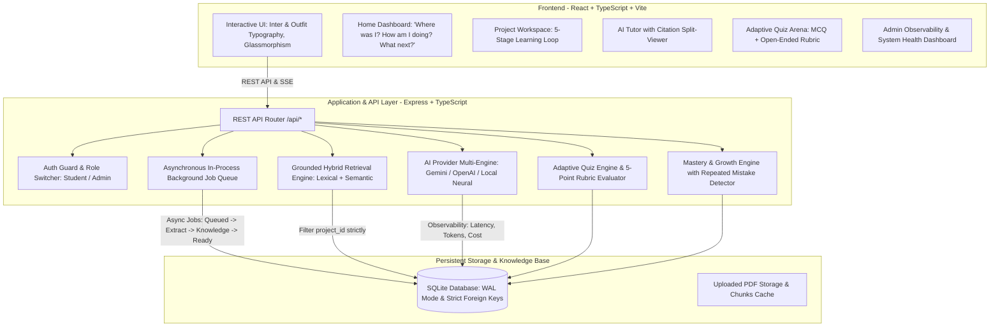

# Architecture Documentation: AI Study Companion

## 1. System Architecture Overview

AI Study Companion is built with a decoupled client-server architecture designed for contextual grounding, asynchronous background ingestion, project-level data isolation, and comprehensive AI observability.

---

## 2. Key Architectural Decisions & Rationale

### A. Project-Level Isolation & Security (PRD Section 3, 15)
- **Problem:** In multi-tenant learning spaces, learning materials or conversations from unrelated projects could leak into retrieval context.
- **Solution:** Every table (`materials`, `document_chunks`, `concepts`, `concept_mastery`, `conversations`, `messages`, `quizzes`, `recommendations`) enforces a foreign key to `project_id`. All retrieval queries in `RetrievalEngine` execute with a mandatory `WHERE project_id = ?` clause.
- **Prompt Injection Defense:** Uploaded documents and student messages are encapsulated in delimited data blocks rather than raw system instructions, mitigating prompt injection risks.

### B. Dual-Mode AI Provider with High-Fidelity Fallback (PRD Section 14)
- **Problem:** Relying purely on external commercial APIs (Gemini/OpenAI) can lead to prototype failures due to missing API keys, rate limits, or network latency.
- **Solution:** A unified `AiProviderService` abstracts text completion, structured JSON output, and embeddings. If external keys are configured, it connects to Gemini/OpenAI; otherwise, it seamlessly uses an intelligent local engine that performs real semantic retrieval from uploaded chunks, emits genuine page citations, evaluates open-ended answers with a 5-point rubric, and calculates mastery evolution.

### C. Asynchronous Document Processing Pipeline (PRD Section 5, 13)
- **Pipeline Stages:** `Upload` $\to$ `Queued` $\to$ `Processing / OCR` $\to$ `Content & Structure Extraction` $\to$ `Knowledge Extraction` $\to$ `Search / Retrieval Representation (Ready)`.
- **Worker Design:** An in-process background worker queue (`BackgroundQueueService`) with concurrency limits, exponential backoff retries, and job status tracking ensures long-running document ingestion never blocks the user.

### D. Grounded AI & Insufficient Evidence Protocol (PRD Section 7)
- **Decision:** If a student asks an out-of-scope question (e.g. baking recipes in a machine learning course), the system computes retrieval relevance against an evidence threshold ($0.25$). If the top chunk score falls below threshold, the Tutor flags `is_unsupported_question = true` and generates an explicit refusal explaining insufficient evidence rather than hallucinating answers.

### E. Adaptive Assessments & 5-Point Open-Ended Rubric (PRD Section 9)
- **Adaptive Selection:** Quizzes target concepts with lowest mastery scores or flagged as `needs_attention`.
- **5-Point Rubric:** Evaluates:
  1. *Understanding* (conceptual depth)
  2. *Accuracy* (correctness)
  3. *Relevance* (focus)
  4. *Key Concepts Covered* (matched terms)
  5. *Missing Concepts* (nuances to deepen)
  6. *Constructive Feedback* (actionable explanation)

---

## 3. Database Schema

The SQLite schema represents relational integrity across learning entities:
- `users`: id, email, name, role ('student' | 'admin'), created_at
- `spaces`: id, user_id, name, description, icon, color, created_at
- `projects`: id, space_id, user_id, name, description, learning_goal, target_date
- `materials`: id, project_id, filename, original_name, file_path, status, stage, page_count, extracted_concepts_count
- `document_chunks`: id, material_id, project_id, page_number, content, token_count
- `concepts`: id, project_id, name, description, category, importance_score
- `concept_mastery`: id, project_id, concept_id, concept_name, mastery_score, confidence, status, history_json
- `conversations` & `messages`: threaded discussions with structured citations and tokens used
- `quizzes`, `quiz_questions`, `quiz_attempts`, `quiz_answers`: assessments with rubric scores
- `learning_events`: event log powering downstream reactive workflows
- `recommendations`: targeted next-step study suggestions
- `ai_logs`: observability telemetry (latency, tokens prompt/completion, cost, model, status)
- `persistent_context`: learner goals, strengths, weaknesses, repeated mistakes
